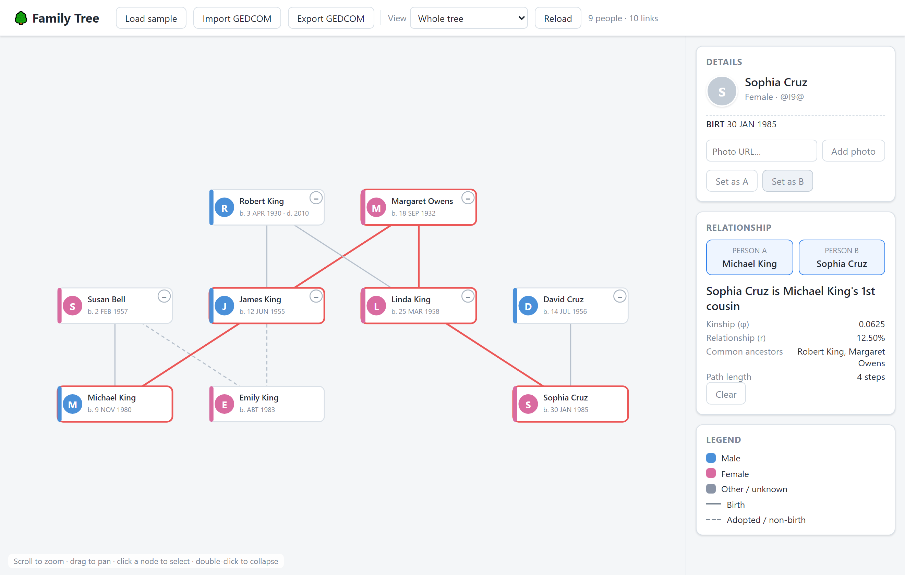
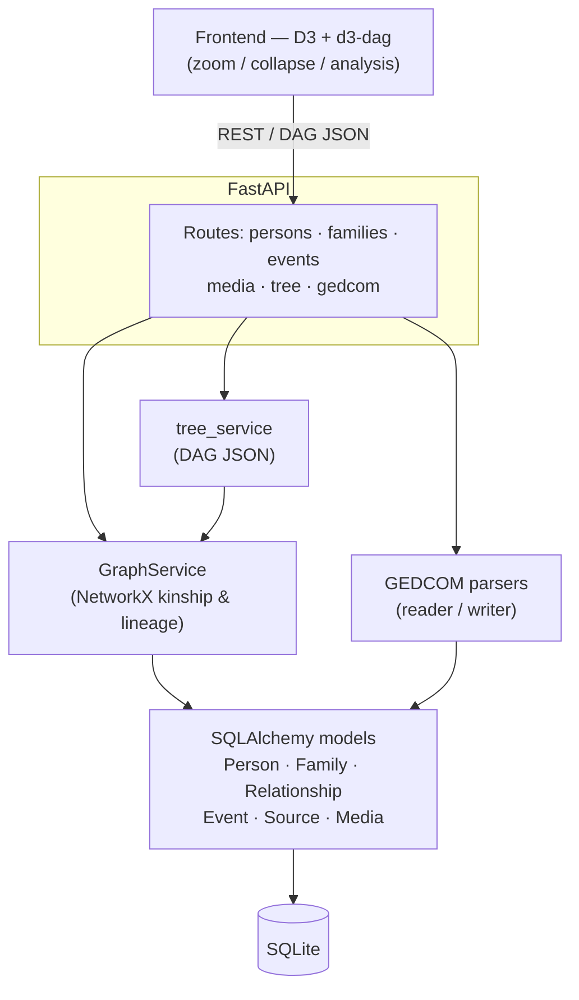

# Family Tree

[](https://github.com/jerged24/family-tree/actions/workflows/ci.yml)

An interactive, GEDCOM-backed family tree application: import/export real `.ged` files,
explore an interactive graph, and compute genetic kinship between any two people.



## Highlights

- **GEDCOM 5.5.1 import/export** with idempotent round-trip fidelity (parse → export → re-parse is stable).
- **Genetic kinship engine** (NetworkX): ancestors/descendants, most-recent common ancestor,
  relationship paths, and the kinship coefficient φ / coefficient of relationship r — traversing
  **biological edges only**, so an adopted child correctly reads as 0 genetic kinship while staying
  on the social tree.
- **Interactive D3 / d3-dag graph**: zoom, pan, collapsible subtrees, click-to-select, and a
  two-person relationship analysis with the connecting path highlighted.
- **Non-traditional families**: multiple marriages, blended families, same-sex partners, and
  adoption all fall out of the DAG membership model with no special cases.
- **Photos**: attach a photo to any person; it surfaces as an avatar on the tree and round-trips
  through GEDCOM `OBJE`.
- **Self-contained**: d3 / d3-dag are vendored — no runtime CDN dependency.

## Architecture



The core idea: the tree is a **directed acyclic graph** of people. Membership in `Family` units
(via the `Relationship` table) yields parent→child edges, so complex family structures need no
special-casing. See [`CLAUDE.md`](CLAUDE.md) for the full design and conventions.

## Quick start

```bash
python -m venv .venv
.venv\Scripts\activate                 # Windows
pip install -r requirements.txt

python -m backend.app.database          # create familytree.db
uvicorn backend.app.main:app --reload   # API + docs at http://127.0.0.1:8000/docs
python -m http.server 5500 --directory frontend   # frontend at http://127.0.0.1:5500
```

Then open the frontend and click **Load sample** to explore a bundled three-generation family.

## API overview

| Area | Endpoints |
|------|-----------|
| People | `GET/POST/PATCH/DELETE /persons`, `/persons/{id}/events`, `/persons/{id}/media` |
| Families | `GET/POST/PATCH/DELETE /families`, `/families/{id}/members` |
| Tree | `GET /tree`, `/tree/person/{id}?mode=…`, `/tree/relationship/{a}/{b}` |
| GEDCOM | `POST /gedcom/import?mode=merge\|append`, `POST /gedcom/sample`, `GET /gedcom/export` |

## Testing

```bash
pytest            # unit + integration (69 tests; e2e excluded by default)
pytest -m e2e     # browser tests (after: playwright install chromium)
```

CI runs lint (ruff + black), unit tests on Python 3.11 / 3.12, and the Playwright e2e suite on
every push.
